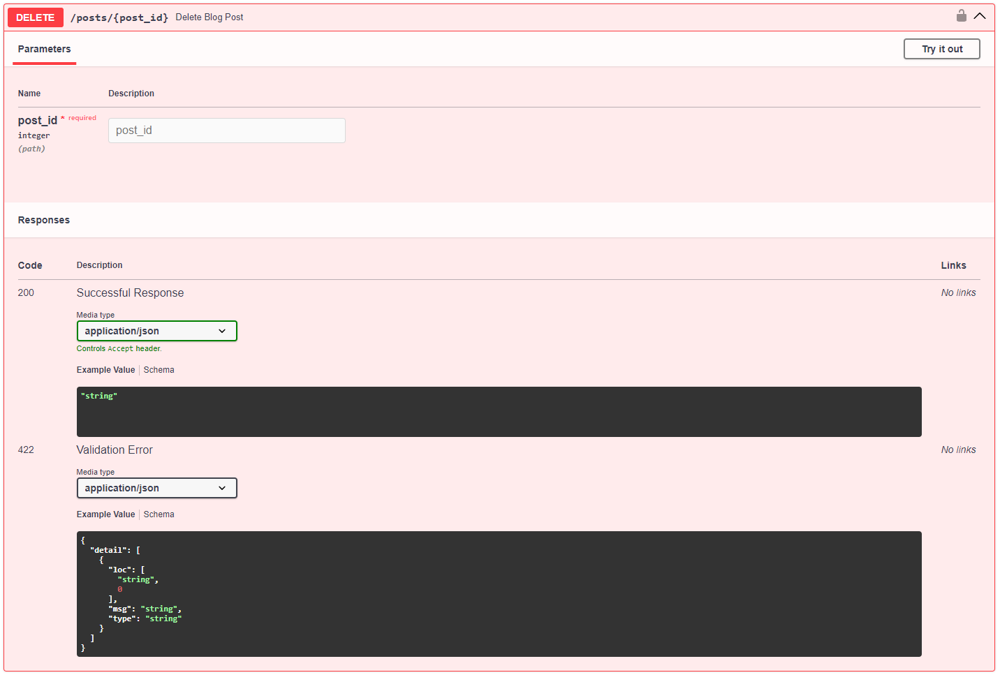

# FastAPI Blog API (Basisproject)

## Beschrijving

Dit basisproject implementeert een RESTful API voor het beheren van blogposts met behulp van FastAPI.

## Gehoste API

Deze API is gehost op Okteto Cloud. Je kunt de API-documentatie en voorbeelden vinden op de volgende locatie:

[Okteto Cloud Container](https://blogpost-api-renzodotexe.cloud.okteto.net/docs/)

## Aantoonbare Werking

Hieronder vind je screenshots die de werking van elk API-endpoint demonstreren.

### Weergeven Alle Blogposts

- **Alle Blogposts**
  

### Aanmaken Blogpost

- **Autorisatie**
  
- **Request Body**
  
- **Fout bij duplicaat**
  
- **Verkeerd datatype**
  

### Ophalen Specifieke Blogpost

- **Geldige ID**
  
- **Ongeldige ID**
  

### Updaten Blogpost

- **Gewijzigde Waarden**
  
- **Bewijs dat ID niet kan worden gewijzigd**
  

### Leegmaken Database

- **Succes**
  
- **Niet Geautoriseerd**
  
- **Bewijs**
  

## Volledige OpenAPI Documentatie

Screenshots van de volledige OpenAPI-docs pagina:

- **Overzicht**
  
- **GET - Alle Blogposts**
  
- **POST - Nieuwe Blogpost**
  
- **GET - Zoeken Blogpost Op ID**
  
- **PUT - Bijwerken Blogpost Op ID**
  
- **DELETE - Verwijderen Blogpost Op ID**
  
- **POST - Volledige Database Legen**
  
