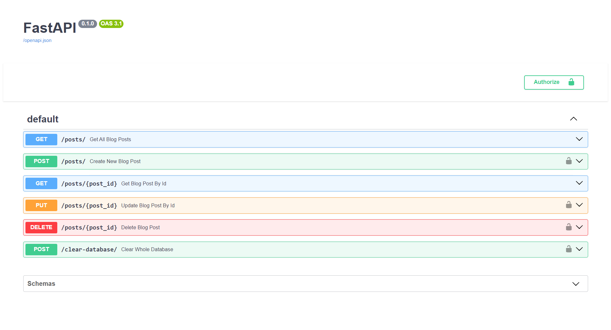

# FastAPI Blog API (Basisproject)

## Beschrijving

Dit basisproject implementeert een RESTful API voor **het beheren van blogposts** met behulp van FastAPI.

## Hosted API

Deze API is gehost op Okteto Cloud. Je kunt de API-documentatie en voorbeelden vinden op de volgende locatie:

[Okteto Cloud Container](https://base-project-api-dev-renzodotexe.cloud.okteto.net/docs)

## Aantoonbare Werking

Hieronder kan je screenshots vinden die elk endpoint van de API demonstreren.

### Weergeven Alle Blogposts

- 
- 

### Aanmaken Blogpost

- 
- 

### Ophalen Specifieke Blogpost

- 
- 

### Updaten Blogpost

- 
- 

### Leegmaken Database

⚠️ **Let op**: Dit is een bijkomend component.

- 
- 

## Volledige OpenAPI Docs

Screenshots van de volledige OpenAPI-docs pagina:

